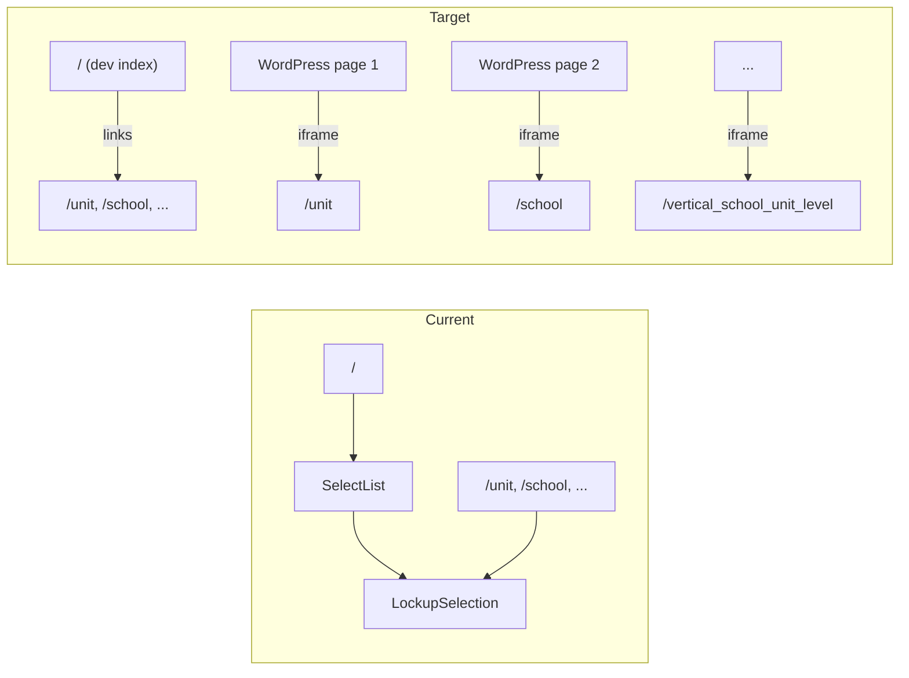

# Multi-Page Logo Generator for WordPress Embedding

## Current State

Most of the routing infrastructure already exists. The app currently has two entry points:

- [`app/page.tsx`](app/page.tsx) — home page with `<LockupSelection allowChoice />` and a SelectList for all 14 styles
- [`app/[logo]/page.tsx`](app/[logo]/page.tsx) — already generates 14 static routes via `generateStaticParams`, each rendering `<LockupSelection lockupChoice={params.logo} />` without the SelectList

The download flow (checkboxes + `/api/convert` + zip download) is fully implemented inside [`lockup-selection.tsx`](src/components/elements/lockup/lockup-selection.tsx) and does not need changes.



## Target URL Map

Each WordPress page embeds one stable URL:

| URL path | Logo style |
|---|---|
| `/unit` | Unit (1 Line) |
| `/unit_2_line` | Unit (2 Lines) |
| `/unit_level` | Unit + Level (1 Line) |
| `/unit_2_lines_big_small` | Unit (2 Lines, Small/Big) |
| `/unit_2_lines_level` | Unit (2 Lines) + Level |
| `/school` | School Only |
| `/alt_school` | Alt School + Unit (1 Line) |
| `/multidisciplinary` | Multidisciplinary |
| `/vertical_unit` | Vertical - Unit |
| `/vertical_unit_2_lines` | Vertical - Unit (2 Lines) |
| `/vertical_2_lines_level` | Vertical - Unit (2 Lines) + Level |
| `/vertical_school` | Vertical - School |
| `/vertical_school_unit` | Vertical - School + Unit (2 Lines) |
| `/vertical_school_unit_level` | Vertical - School + Unit + Level |

Root `/` will be a **dev-only index** — a simple list of links to all 14 style pages. This page is not embedded in WordPress; it exists so developers can navigate the app locally and in staging.

## Implementation Steps

### 1. Replace the home page with a dev index

Replace [`app/page.tsx`](app/page.tsx) with a minimal server component that maps over `LOCKUP_OPTIONS` and renders a plain `<ul>` of `<Link>` items:

```tsx
import Link from "next/link"
import { LOCKUP_OPTIONS } from "@components/elements/lockup/lockup-options"

const Home = () => (
  <article className="m-20">
    <h1>Stanford Logo Generator</h1>
    <p>Select a logo style:</p>
    <ul>
      {LOCKUP_OPTIONS.map(({ slug, label }) => (
        <li key={slug}>
          <Link href={`/${slug}`}>{label}</Link>
        </li>
      ))}
    </ul>
  </article>
)
```

No SelectList, no preview, no download — just navigation links for local/staging use.

### 2. Extract shared lockup config

Create a small shared config (e.g. [`src/components/elements/lockup/lockup-options.ts`](src/components/elements/lockup/lockup-options.ts)) exporting:

- `LockupOption` type (move from `lockup-selection.tsx`)
- `LOCKUP_OPTIONS` array with `{ slug, label }` for all 14 styles
- `getDefaultLines(lockupOption)` helper for the per-style placeholder text currently in the switch block

This eliminates duplication between `generateStaticParams` in [`app/[logo]/page.tsx`](app/[logo]/page.tsx) and the removed SelectList options array.

### 3. Simplify `LockupSelection`

In [`lockup-selection.tsx`](src/components/elements/lockup/lockup-selection.tsx):

- Remove `allowChoice` prop and all SelectList UI (lines 209–235)
- Remove `SelectList` import
- Remove internal `lockupOption` state — use the required `lockupChoice` prop directly (style is fixed per page)
- Use `getDefaultLines(lockupChoice)` for initial line values
- Keep preview, text inputs, format checkboxes, and download button unchanged

Updated signature:

```tsx
export const LockupSelection = ({ lockupChoice }: { lockupChoice: LockupOption }) => { ... }
```

### 4. Update the dynamic route page

In [`app/[logo]/page.tsx`](app/[logo]/page.tsx):

- Import `LOCKUP_OPTIONS` for `generateStaticParams` instead of hardcoding the array
- Add `generateMetadata` per style (e.g. `"Unit (1 Line) — Stanford Logo Generator"`) for better embed/page titles

### 5. Delete unused SelectList component

[`src/components/elements/select-list.tsx`](src/components/elements/select-list.tsx) is only used by the current home page SelectList. Remove it after the home page is replaced.

### 6. Allow iframe embedding from WordPress

No iframe/frame headers are configured today. For WordPress embeds to work, add headers in [`next.config.ts`](next.config.ts) so the app can be framed by the Stanford WordPress domain(s):

```ts
async headers() {
  return [{
    source: "/:path*",
    headers: [{
      key: "Content-Security-Policy",
      value: "frame-ancestors 'self' https://*.stanford.edu https://stanford.edu",
    }],
  }]
}
```

Adjust the allowed domains to match the actual WordPress host(s). If the WP site uses a non-Stanford domain, that origin must be included here.

### 7. Verify download works in iframe context

The existing download uses `fetch("/api/convert")` + `downloadjs(blob)` — this is same-origin relative to the iframe and should work. Manually test one embedded page after deploy to confirm the zip download triggers correctly from within a WordPress iframe.

## WordPress Embedding Guide

Each of the 14 logo styles gets its **own WordPress page** with its **own iframe** pointing at a **unique URL** on the deployed Next.js app. There is no shared embed URL — the style is determined by the path, not by a dropdown.

### How it works

1. Deploy this app to a stable host (e.g. `https://logo-generator.stanford.edu`)
2. On each WordPress page, add a Custom HTML block (or equivalent) with an iframe whose `src` is the specific style URL
3. Repeat for all 14 WP pages, each with a different `src`

### Example iframe markup

For a WordPress page about the "Unit (1 Line)" logo style:

```html
<iframe
  src="https://logo-generator.stanford.edu/unit"
  title="Stanford Logo Generator — Unit (1 Line)"
  width="100%"
  height="900"
  style="border: 0;"
  loading="lazy"
></iframe>
```

For the "Vertical - School + Unit + Level" style on a different WP page:

```html
<iframe
  src="https://logo-generator.stanford.edu/vertical_school_unit_level"
  title="Stanford Logo Generator — Vertical School + Unit + Level"
  width="100%"
  height="900"
  style="border: 0;"
  loading="lazy"
></iframe>
```

### Full URL reference for WordPress editors

Replace `https://logo-generator.stanford.edu` with the actual production URL:

| WordPress page topic | iframe `src` |
|---|---|
| Unit (1 Line) | `https://logo-generator.stanford.edu/unit` |
| Unit (2 Lines) | `https://logo-generator.stanford.edu/unit_2_line` |
| Unit + Level (1 Line) | `https://logo-generator.stanford.edu/unit_level` |
| Unit (2 Lines, Small/Big) | `https://logo-generator.stanford.edu/unit_2_lines_big_small` |
| Unit (2 Lines) + Level | `https://logo-generator.stanford.edu/unit_2_lines_level` |
| School Only | `https://logo-generator.stanford.edu/school` |
| Alt School + Unit (1 Line) | `https://logo-generator.stanford.edu/alt_school` |
| Multidisciplinary | `https://logo-generator.stanford.edu/multidisciplinary` |
| Vertical - Unit | `https://logo-generator.stanford.edu/vertical_unit` |
| Vertical - Unit (2 Lines) | `https://logo-generator.stanford.edu/vertical_unit_2_lines` |
| Vertical - Unit (2 Lines) + Level | `https://logo-generator.stanford.edu/vertical_2_lines_level` |
| Vertical - School | `https://logo-generator.stanford.edu/vertical_school` |
| Vertical - School + Unit (2 Lines) | `https://logo-generator.stanford.edu/vertical_school_unit` |
| Vertical - School + Unit + Level | `https://logo-generator.stanford.edu/vertical_school_unit_level` |

### Prerequisites for embeds to work

- **CSP `frame-ancestors` header** (step 6 above) must include the WordPress site's origin, or the browser will block the iframe
- **Fixed iframe height** — start with ~900px and adjust per style; vertical logos may need more height. WordPress Custom HTML blocks do not auto-resize iframes
- **Do not embed `/`** — the root index is for dev navigation only; always embed a specific style path like `/unit`

## Out of Scope (unless requested)

- Resizing iframe height dynamically via postMessage
- Reducing the `m-20` outer margin for tighter embed layout
- WordPress plugin or block development (use Custom HTML blocks instead)

## Files Changed

| File | Action |
|---|---|
| `app/page.tsx` | Replace with dev index of links |
| `src/components/elements/lockup/lockup-options.ts` | Create |
| `src/components/elements/lockup/lockup-selection.tsx` | Simplify (remove SelectList, use fixed style) |
| `app/[logo]/page.tsx` | Use shared config + add metadata |
| `src/components/elements/select-list.tsx` | Delete |
| `next.config.ts` | Add `frame-ancestors` CSP header |
